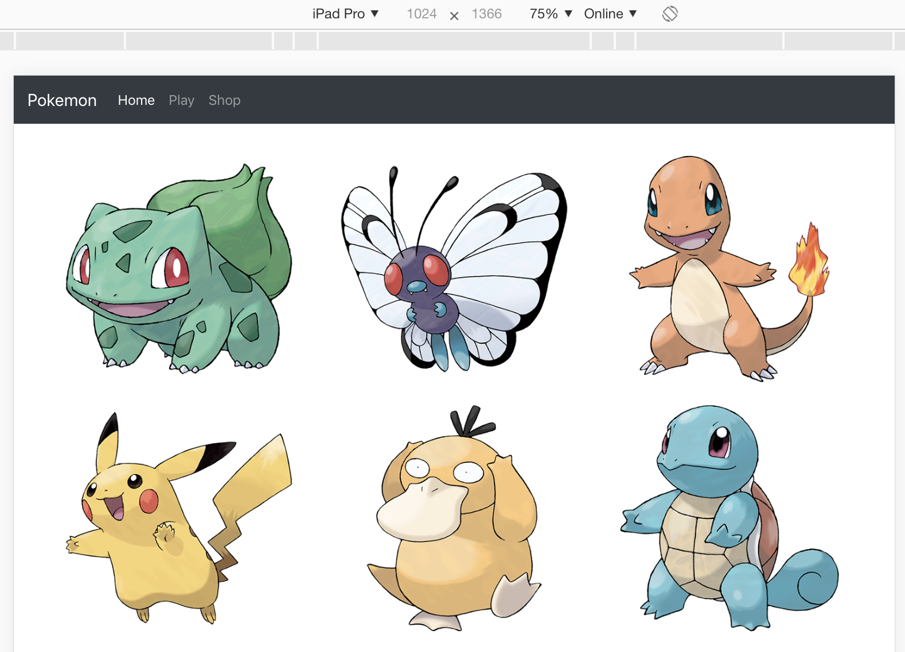
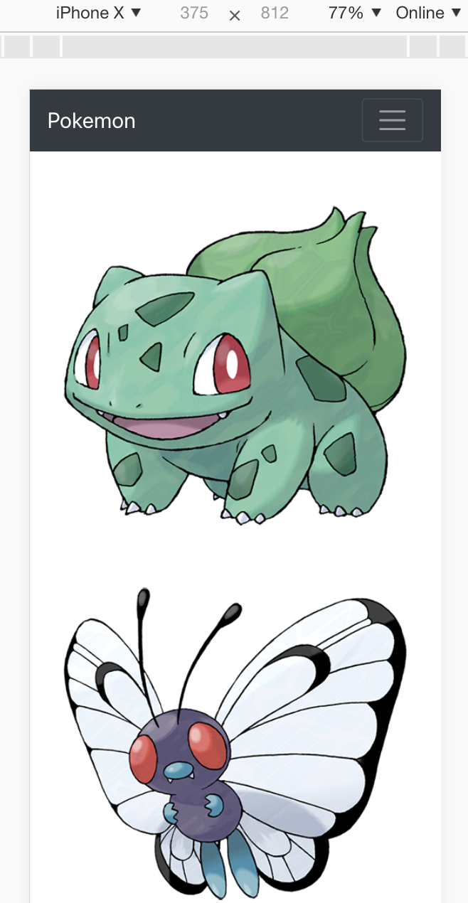

# Homework 4

使用Bootstrap在index.html製作下列內容

+ 使用CDN方式將Bootstrap v4.1的CSS檔案與相關JavaScript檔案匯入index.html
+ index.html網頁上方有黑色的Nav Bar, 內容呈現如下 

+ 將images目錄中的六張圖片, 利用Bootstrap的Grid系統, 將六張圖片放入網頁中並呈現如下：

### IPAD Pro (3 images per row)

### IPAD (2 images per row)

### IPhone (1 image per row)

